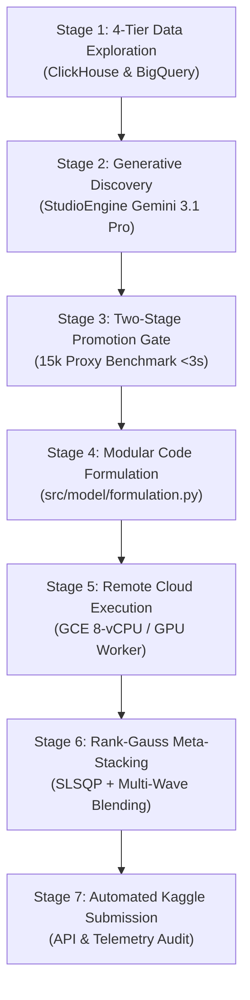

# 🏆 S6E8 Master Competitive ML Workflow & Runbook

This skill is the authoritative, unified operational engine for **Kaggle Playground Series s6e8** (`Predicting-Smartphone-Addiction`). It integrates all rules, cloud blueprints, and tools into a single, cohesive workflow.

---

## 🧭 Invariant Operational Directives

1. **Zero Local Footprint Policy:** Heavy 10-fold cross-validation, hyperparameter tuning, and model training MUST execute remotely on Google Cloud (`google-compute-engine`) or Google Colab (`google-colab-cli`). Local machine is strictly for instant sanity tests (`pytest -v`) and orchestration.
2. **Strict VPS Node Protection Invariant:** NEVER touch, stop, modify, or delete the 3 existing VPS nodes on project `ali-antigravity-hub-2026`:
   * `eco-v2ray` (`us-central1-a`)
   * `ali-vpn-node` (`us-east1-b`)
   * `eco-app-service` (`us-east1-c`)
3. **Mandatory MCP-First Protocol:** Always use native MCP tools (`call_mcp_tool` / eager tools) before writing ad-hoc scripts or running shell commands.
4. **Zero Workspace Pollution Rule:** Never create one-off throwaway scripts in the workspace root. Keep code modular inside `src/model/`.

---

## 🔄 The 7-Stage Master Grandmaster Cycle

---

### 📊 Stage 1: 4-Tier Data Exploration & Screening
* **ClickHouse MCP (`clickhouse`):** High-dimensional in-memory columnar screening of non-linear interaction candidates (`st * sm`, `st / (24 - sl)`, `(st - 5.5) * (sm + gm)`).
* **BigQuery MCP (`bigquery`):** Group-level cohort aggregations, age/gender z-scores, and cross-tabulation statistical distributions.
* **Cloud Firestore MCP (`google-cloud-firestore`):** Persistent Feature Store & Prompt Vault — store promoted feature AST definitions as structured JSON documents.
* **Cloud SQL MCP (`cloud-sql`):** Relational Experiment Tracking Ledger — record trial hyperparameters, fold AUCs, and submission metrics.

---

### 🧠 Stage 2: Generative Feature Discovery (StudioEngine)
* Dispatch residual error patterns and hard-subgroup matrices to **Google AI Studio (Gemini 3.1 Pro)** via `StudioEngine`.
* Formulate continuous interactions, domain boundaries, and discrete categorical interactions.
* Enforce **Discrete 2-Way Target Encoding Rule:** Never apply 2-way TE to high-cardinality continuous floats; apply exclusively to low-cardinality discrete categories (`gender x stress`, `gender x impact`, `stress x impact`) with `smooth=20.0`.

---

### 🧪 Stage 3: Two-Stage Promotion Gate
* **Fast Proxy Screening (<3s):** Evaluate candidate features on a stratified 15k proxy subset using 3-fold CV.
* **Promotion Threshold:** Reject any feature candidate yielding $\Delta \text{AUC} < +0.0003$ or showing Kolmogorov-Smirnov (KS) train/test drift ($p < 0.05$).
* **Full Benchmark Gate:** Run 30k proxy evaluation across LightGBM, XGBoost, and CatBoost.

---

### 🛠️ Stage 4: Clean Modular Integration & Unit Testing
* Incorporate approved mathematical features cleanly into `src/model/formulation.py`.
* Ensure zero divide-by-zero errors (using `np.clip` and epsilon smoothing).
* Update `UniversalLevelTargetEncoder` inside `src/model/solver.py` with vectorized NumPy `np.bincount` implementation for C-speed encoding (<0.2s).
* Execute local verification: `pytest -v tests/` (must pass 100% of unit tests).
* Stage, commit, and push changes to GitHub (`AliAziziDH/Predicting-Smartphone-Addiction`) with clear semantic commit messages.

---

### ⚡ Stage 5: Remote Cloud Execution (GCE / Colab)
* Provision an `e2-standard-8` (or Nvidia GPU) worker on Google Cloud in `us-central1-c`.
* **Calibrated Production Hyperparameters:**
  * **LightGBM:** `lr=0.025`, `n_estimators=2500`, `num_leaves=63`, `colsample_bytree=0.70`, `subsample=0.85`, `reg_alpha=0.1`, `reg_lambda=5.0`, `early_stopping=80`.
  * **XGBoost:** `lr=0.025`, `n_estimators=2500`, `max_depth=6`, `tree_method='hist'`, `colsample_bytree=0.65`, `subsample=0.85`, `reg_alpha=0.5`, `reg_lambda=8.0`, `early_stopping=80`.
  * **CatBoost:** `lr=0.03`, `iterations=2200`, `depth=6`, `l2_leaf_reg=6.0`, `od_type='Iter'`, `od_wait=80`.
* **Preemption Watchdog:** Captures `SIGTERM` on spot instances and immediately syncs checkpoints to `gs://ali-s6e8-kaggle-artifacts-2026/checkpoints/`.
* **Fold-Level Checkpoint Vault:** Saves `fold_k_checkpoint.npz` containing OOF probabilities, test predictions, and fold validation indices.

---

### 👑 Stage 6: Rank-Gauss Meta-Stacking & Multi-Wave Blending
1. **Rank-Gauss Transformation:** Convert raw OOF probabilities into normalized Gaussian distributions:
   $$z_m = \Phi^{-1}\left( \frac{\text{Rank}(\hat{y}_m) - 0.5}{N} \right)$$
2. **SLSQP Convex Optimization:** Solve for non-negative stacking weights $\sum w_m = 1$ that directly maximize ROC-AUC.
3. **Multi-Wave Blending:** Blend Wave 9 (54 features) + Wave 10 (63 features) test predictions using optimal rank weights to minimize model variance and unlock the Top 100 score threshold (`0.9710+`).

---

### 📤 Stage 7: Automated Kaggle Submission & Telemetry
1. Synchronize final `submission_elite_wave*.csv` directly from GCS bucket.
2. Submit via Kaggle CLI: `kaggle competitions submit -c playground-series-s6e8 -f <submission.csv> -m "<description>"`.
3. Inspect live leaderboard score and rank shifts using `chrome-devtools-mcp` or Kaggle submissions audit.
4. Emit structured Post-Run Telemetry & Quota Report.
