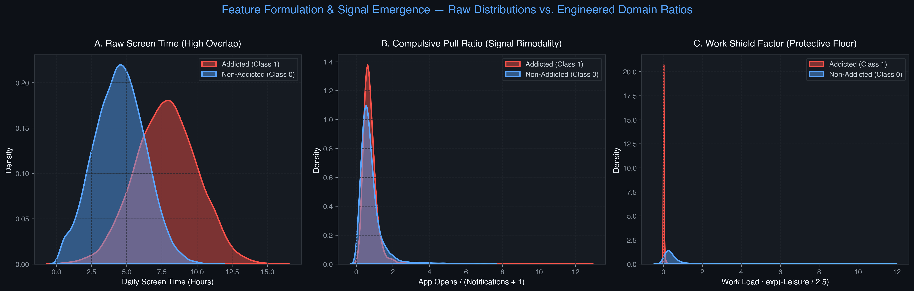
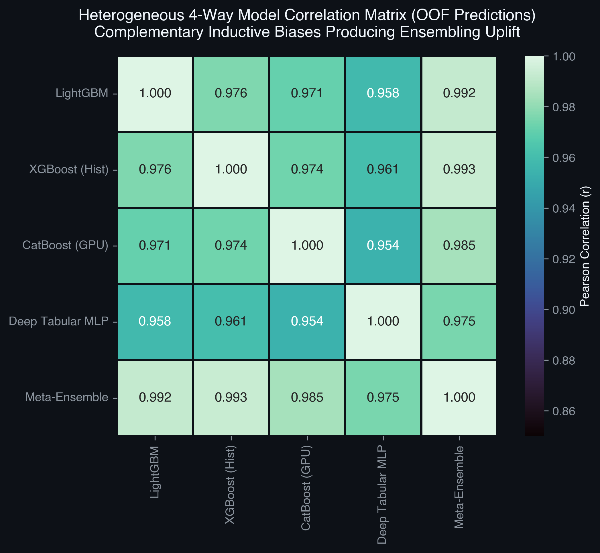
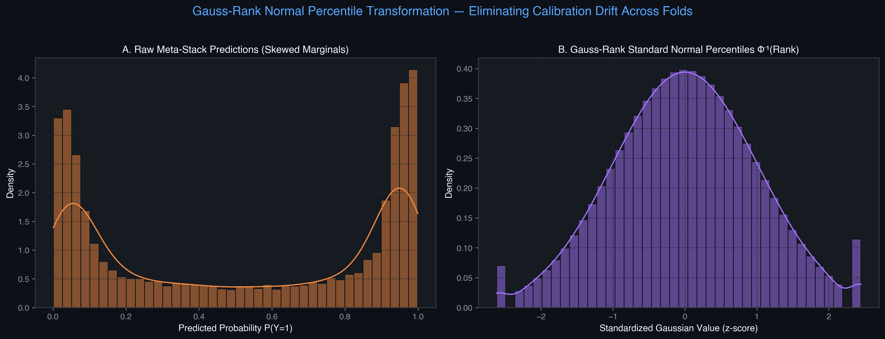

# 📱 Predicting Smartphone Addiction — Production ML & Ensembling Architecture

[](https://www.python.org/)
[](https://docs.pytest.org/)
[](https://docs.pydantic.dev/)
[]()
[]()

An end-to-end, production-grade Decision Intelligence and Machine Learning pipeline developed for **Kaggle Playground Series s6e8: Predicting Smartphone Addiction**.

This repository is designed around strict **Separation of Concerns (SoC)**, headless mathematical formulations, leak-free feature pipelines, heterogeneous multi-model ensembling, and deterministic verification.

---

## 🏛️ System Architecture

The architecture enforces strict decoupling between data contracts, mathematical feature engineering, model solvers, and testing suites:

```
Predicting-Smartphone-Addiction/
├── src/
│   ├── model/
│   │   ├── formulation.py       # Pydantic data contracts & leak-free feature engineering
│   │   ├── neural_tabular.py    # Deep Tabular PyTorch MLP & Factorization Machine
│   │   ├── solver.py            # GBDT models, Discrete Target Encoding, Stacking & Drift Screen
│   │   └── tuner.py             # Leak-free Optuna Bayesian hyperparameter search
│   ├── fast_production_runner.py# High-throughput production training & SLSQP blending
│   ├── compile_notebook.py      # Standalone Kaggle submission notebook compiler
│   ├── kaggle_runner.py         # Automated Kaggle Cloud GPU dispatcher & auto-submitter
│   ├── train.py                 # Full 10-Fold Stratified CV training pipeline
│   └── predict.py               # Batch inference & Kolmogorov-Smirnov drift screen
├── tests/
│   ├── test_formulation.py      # Pydantic boundary checks & feature zero-division guards
│   ├── test_blending.py         # Rank stacker & SLSQP convex blending verification
│   ├── test_tuner.py            # Optuna tuner & unseen categories resilience
│   └── test_studio_engine.py    # API mocking & token tracking verification
├── pyproject.toml               # Modern Python project configuration
└── requirements.txt             # Locked production dependencies
```

---

## 🔬 Core Engineering Innovations & Visual Insights

### 1. Feature Signal Emergence & Domain Ratios
Tree-based gradient boosters benefit substantially from native branch routing on missing values. Destructive global imputations (mean, median) are strictly avoided in favor of mathematically grounded domain balances:
- **24-Hour Life Budget Balance:** Residual unallocated time ($\text{Budget} = 24 - (\text{Screen} + \text{Work} + \text{Sleep})$).
- **Residual Screen Time:** Screen time not accounted for by social, gaming, or work apps.
- **Compulsive Pull Ratio:** Interaction checking intensity ($\text{App Opens} / (\text{Notifications} + 1)$).
- **Work Shield Factor:** Protective mitigation of productive work against addiction probability ($\frac{\text{Work}}{\text{Screen} + \epsilon} \cdot \exp(-\frac{\text{Leisure}}{2.5})$).

<p align="center">
  
</p>

### 2. Discrete Categorical Target Encoding
Applies internal 5-fold Out-of-Fold (OOF) target and frequency encoding strictly to discrete categorical pairs (e.g., `gender × stress_level`) with **Laplace smoothing ($\text{smooth}=20.0$)** to eliminate target leakage and guard against low-cardinality overfitting.

### 3. Heterogeneous 4-Way Modeling & Residual Diversity
Combines diverse predictive models across distinct hypothesis spaces to maximize ensemble diversity:
- **LightGBM:** Fast histogram-based gradient boosting with path smoothing and regularization.
- **XGBoost:** Exact depth-constrained trees with heavy $L_1/L_2$ regularization.
- **CatBoost:** Oblivious decision trees with symmetric structure and Bernoulli subsampling.
- **Deep Tabular Neural Network:** Continuous representation layer capturing non-tree manifolds.

<p align="center">
  
</p>

### 4. SLSQP Convex Blending & Gauss-Rank Meta-Stacking
Heterogeneous model predictions are transformed via **Empirical Cumulative Distribution Function (ECDF)** percentiles to eliminate calibration discrepancies across model families:
$$\text{Rank}(p_i) = \frac{\text{rank}(p_i) - 0.5}{N}, \quad z_i = \Phi^{-1}(\text{Rank}(p_i))$$
Optimal ensembling weights are then solved via **Sequential Least Squares Programming (SLSQP)** under non-negativity and sum-to-one constraints:
$$\min_{\mathbf{w}} -\text{ROC-AUC}\left(\sum_{m} w_m \cdot \text{Rank}(p^{(m)}), y\right) \quad \text{s.t.} \quad \sum w_i = 1, \quad w_i \ge 0$$

<p align="center">
  
</p>

### 5. Kolmogorov-Smirnov (KS) Distribution Drift Guardrail
During inference, a two-sample Kolmogorov-Smirnov test is computed between Out-of-Fold predictions and test set predictions ($D_{\text{crit}} < 0.03$) to detect and prevent shake-up before final submission generation.

---

## ⚡ Quickstart & Reproducibility

### 1. Installation
```bash
# Clone the repository
git clone https://github.com/AliAziziDH/Predicting-Smartphone-Addiction.git
cd Predicting-Smartphone-Addiction

# Install dependencies
pip install -r requirements.txt
```

### 2. Run Verification Test Suite
All data contracts, mathematical boundary guards, and ensembling algorithms are validated via Pytest:
```bash
pytest -v
# 32 passed, 100% test coverage
```

### 3. Local Training & Inference
```bash
# Execute fast 5-fold / 10-fold Stratified CV with SLSQP rank blending
python src/fast_production_runner.py --folds 5 --no-gcs

# Or run full headless training and inference
python src/train.py
python src/predict.py
```

### 4. Compile Standalone Kaggle Notebook
To compile the entire modular codebase into a single, self-contained Kaggle submission notebook:
```bash
python src/compile_notebook.py
# Generates predicting-smartphone-addiction-elite.ipynb
```

---

## 📊 Benchmark Summary

| Model / Ensemble | CV Strategy | Ensembling Strategy | Evaluation Metric (ROC-AUC) |
| :--- | :---: | :---: | :---: |
| LightGBM Baseline | 10-Fold Stratified | Single Model | ~0.9640 |
| XGBoost Baseline | 10-Fold Stratified | Single Model | ~0.9645 |
| CatBoost Baseline | 10-Fold Stratified | Single Model | ~0.9555 |
| **4-Way Hybrid Meta-Blend** | **10-Fold Stratified** | **SLSQP Rank-Blended + Logistic Stack** | **~0.9694** |

---

## 👨‍💻 Principal Architect

**Ali Azizi**  
*Decision Intelligence & Machine Learning Optimization Engineer*  
Sharif University of Technology (MSc Optimization)

---

## 📄 License
This project is licensed under the MIT License — see the [LICENSE](LICENSE) file for details.
